# unitAI PR Journey: Architecture to Observability

## Complete Work Timeline & Structure

```mermaid
%%{init: {'theme':'dark', 'themeVariables': { 'fontSize':'14px'}}}%%
graph TB
    subgraph FOUNDATION["📐 FOUNDATION (Jan 24 - No PR)"]
        A1[Architecture SSOT<br/>ssot_unitai_architecture_2026-01-24.md<br/>11KB - Core structure defined]
        A2[Known Issues Registry<br/>ssot_unitai_known_issues_2026-01-24.md<br/>14KB - Technical debt mapped]
    end

    subgraph LAYER0["🔧 LAYER 0: DI & LIFECYCLE (Jan 24)"]
        B1["fa3d594: fix Qwen double execution<br/>Jan 21"]
        B2["73a621a: Wizard + config system<br/>Jan 24"]
        B3["2cc82a4: Merge upstream<br/>Jan 24"]
        B4["bba1e92: Merge rico/wizard-and-fixes<br/>Jan 24"]
        B5["f676941: build regenerate dist<br/>Jan 24"]
        B6["a241524: feat(di) consolidate DB connections<br/>Jan 24"]

        DOC0[plan_unitai_di_2026-01-24.md<br/>7.3KB - DI Implementation Plan]
        B1 --> B2 --> B3 --> B4 --> B5 --> B6
        DOC0 -.guides.-> B6
    end

    subgraph LAYER1["🛡️ LAYER 1: SECURITY (Jan 24)"]
        C1["414ce75: feat(security)<br/>Command injection + path traversal fixes<br/>Jan 24"]

        DOC1A[ssot_unitai_security_audit_2026-01-24.md<br/>20KB - Comprehensive security analysis]
        DOC1B[plan_unitai_security_2026-01-24.md<br/>13KB - SEC-001 to SEC-006]
        DOC1A -.audit.-> C1
        DOC1B -.implements.-> C1
    end

    subgraph LAYER2["⚡ LAYER 2: RELIABILITY (Jan 24)"]
        D1["f8a4dcd: feat(reliability)<br/>REL-001 to REL-004<br/>Jan 24"]
        D2["3e632e0: docs update SSOT<br/>Jan 24"]
        D3["74dbda1: fix(security) allow pipe char<br/>Jan 25"]

        DOC2A[ssot_unitai_reliability_audit_2026-01-24.md<br/>26KB - System-wide reliability audit]
        DOC2B[plan_unitai_reliability_2026-01-24.md<br/>8.4KB - REL implementation guide]
        DOC2C[triangulated_review_reliability_2026-01-24.md<br/>26KB - Gemini+Cursor+Droid review]

        D1 --> D2 --> D3
        DOC2A -.audit.-> D1
        DOC2B -.implements.-> D1
        DOC2C -.validates.-> D1
    end

    subgraph LAYER3["🧪 LAYER 3: TESTING (Jan 25)"]
        E1["498696e: test(P0+P1)<br/>96 P0 + 49 P1 unit tests<br/>Jan 25"]
        E2["aba54d5: test(P1)<br/>33 P1 integration tests<br/>Jan 25"]
        E3["769ee66: docs update testing SSOT<br/>178 tests complete<br/>Jan 25"]

        DOC3A[plan_unitai_testing_implementation_2026-01-24.md<br/>11KB - Testing pyramid strategy]
        DOC3B[ssot_unitai_testing_2026-01-24.md<br/>9.1KB - Test coverage tracking]
        DOC3C[delegated_task_p2_testing.md<br/>2.1KB - P2 workflow tests delegation]

        E1 --> E2 --> E3
        DOC3A -.guides.-> E1
        DOC3B -.tracks.-> E3
        DOC3C -.delegates.-> E3
    end

    subgraph LAYER4["📊 LAYER 4: OBSERVABILITY (Jan 25 - CURRENT)"]
        F1["🔨 WIP: RED metrics dashboard<br/>+ structured logging migration"]

        DOC4A[ssot_unitai_observability_2026-01-25.md<br/>3.1KB - Observability foundation]
        DOC4B[IMPLEMENTATION_SUMMARY.md<br/>NEW - Implementation details]
        DOC4C[docs/logger-migration.md<br/>NEW - Migration guide]

        DOC4A -.guides.-> F1
        DOC4B -.documents.-> F1
        DOC4C -.guides.-> F1

        style F1 fill:#ff6b6b,stroke:#ff0000,stroke-width:3px
    end

    subgraph SUPPORT["📋 SUPPORTING DOCS"]
        S1[plan_git_workflow_2026-01-24.md<br/>17KB - Pyramid PR strategy]
        S2[issues_external_tools.md<br/>1.2KB - External tool issues]
    end

    %% Flow connections
    FOUNDATION --> LAYER0
    LAYER0 --> LAYER1
    LAYER1 --> LAYER2
    LAYER2 --> LAYER3
    LAYER3 --> LAYER4

    SUPPORT -.guides all layers.-> LAYER0
    SUPPORT -.guides all layers.-> LAYER1
    SUPPORT -.guides all layers.-> LAYER2
    SUPPORT -.guides all layers.-> LAYER3
    SUPPORT -.guides all layers.-> LAYER4

    %% Styling
    classDef foundation fill:#2d3748,stroke:#4a5568,stroke-width:2px
    classDef layer0 fill:#1a365d,stroke:#2c5282,stroke-width:2px
    classDef layer1 fill:#22543d,stroke:#38a169,stroke-width:2px
    classDef layer2 fill:#744210,stroke:#dd6b20,stroke-width:2px
    classDef layer3 fill:#5a1e5c,stroke:#9f7aea,stroke-width:2px
    classDef layer4 fill:#742a2a,stroke:#f56565,stroke-width:2px
    classDef docs fill:#1a202c,stroke:#718096,stroke-width:1px,stroke-dasharray: 5 5
    classDef support fill:#234e52,stroke:#319795,stroke-width:2px

    class A1,A2 foundation
    class B1,B2,B3,B4,B5,B6 layer0
    class C1 layer1
    class D1,D2,D3 layer2
    class E1,E2,E3 layer3
    class F1 layer4
    class DOC0,DOC1A,DOC1B,DOC2A,DOC2B,DOC2C,DOC3A,DOC3B,DOC3C,DOC4A,DOC4B,DOC4C docs
    class S1,S2 support
```



---

## Current PR State Summary

### ✅ Completed Layers (13 commits ahead of origin/master)

| Layer | Focus | Commits | Test Coverage | Docs |
|-------|-------|---------|---------------|------|
| **0: DI** | Dependency Injection & Lifecycle | 6 | N/A | 1 plan |
| **1: Security** | Command injection, path traversal | 1 | N/A | 2 docs (audit + plan) |
| **2: Reliability** | Error recovery, circuit breakers | 3 | N/A | 3 docs (audit + plan + review) |
| **3: Testing** | Unit + Integration tests | 3 | **178 tests** | 3 docs (plan + SSOT + delegation) |

### 🔨 In Progress: Layer 4 - Observability

**Current Work:**
- RED metrics dashboard tool
- Structured logging migration (legacyLogger.ts)
- Metrics repository implementation
- Logger migration documentation

**Modified Files:** ~100 files (mostly dist/ compiled output)
**New Files:**
- `PRfolder/ssot_unitai_observability_2026-01-25.md`
- `IMPLEMENTATION_SUMMARY.md`
- `docs/logger-migration.md`
- `src/repositories/metrics.ts`
- `src/tools/red-metrics-dashboard.tool.ts`
- `src/utils/legacyLogger.ts`

---

## Pyramid Progress Tracker

```
                        🔺 PR #7: NEW FEATURES
                      ──────────────────────────
                     PR #6: OPTIMIZATIONS
                   ────────────────────────────────────
                  PR #5: CODE ORGANIZATION
                ────────────────────────────────────────
               PR #4: OBSERVABILITY ← 🔨 CURRENT (Jan 25)
             ──────────────────────────────────────────────
            PR #3: TESTING ✅ COMPLETE (178 tests)
          ────────────────────────────────────────────────
         PR #2: RELIABILITY ✅ COMPLETE (REL-001-004)
       ──────────────────────────────────────────────────────────
      PR #1: SECURITY ✅ COMPLETE (SEC-001-006)
     ────────────────────────────────────────────────────────────
    PR #0: DI & LIFECYCLE ✅ COMPLETE
   ──────────────────────────────────────────────────────
  📐 ARCHITECTURE SSOT ✅ COMPLETE (living docs)
```

---

## Next Steps for Clean PR

### 1. Complete Layer 4 (Observability)
- [ ] Finish RED metrics dashboard implementation
- [ ] Complete logger migration
- [ ] Build and verify dist/ files
- [ ] Write tests for new observability components

### 2. Commit Strategy
```bash
# From /home/rico/Projects/CodeBase/unitAI
git add PRfolder/ssot_unitai_observability_2026-01-25.md
git add IMPLEMENTATION_SUMMARY.md docs/logger-migration.md
git add src/repositories/metrics.ts
git add src/tools/red-metrics-dashboard.tool.ts
git add src/utils/legacyLogger.ts
# ... add other source files
git add dist/  # Compiled output

git commit -m "feat(observability): implement RED metrics dashboard and structured logging

Add comprehensive observability layer (Layer 4 of pyramid):
- RED metrics dashboard tool (Rate, Errors, Duration)
- Metrics repository for activity tracking
- Legacy logger bridge for migration
- Structured logging migration guide

Refs: PRfolder/ssot_unitai_observability_2026-01-25.md

Co-Authored-By: Claude Sonnet 4.5 <noreply@anthropic.com>"
```

### 3. Push and PR
```bash
# Push branch to GitHub
git push origin feat/di-lifecycle

# Create PR on GitHub with PRfolder docs as reference
```

---

## Total Deliverables

### Code Changes
- **13 commits** (all layers 0-3 complete)
- **178 tests** (96 P0 + 49 P1 unit + 33 P1 integration)
- **Layer 4 in progress** (observability)

### Documentation (PRfolder/)
- **4 SSOT documents** (architecture, security, reliability, testing)
- **5 Implementation plans** (DI, security, reliability, testing, git workflow)
- **3 Audit reports** (security, reliability, triangulated review)
- **2 Supporting docs** (known issues, external tools)
- **1 Observability doc** (current layer)

**Total: 14 documents, ~160KB of structured documentation**

---

## Git Safety Notes

⚠️ **CRITICAL: Always work from `/home/rico/Projects/CodeBase/unitAI`**

❌ **NEVER commit from `/home/rico/Projects/CodeBase`** (parent directory)
- Parent contains ESP, SierraChart, TradingSystem, etc.
- Parent has NO remote repository
- Gemini's mistake was committing 146 files from parent

✅ **unitAI is isolated and safe**
- Remote: `https://github.com/Jaggerxtrm/unitAI`
- Branch: `feat/di-lifecycle` (local, ready to push)
- Clean history with focused commits

---

*Generated: 2026-01-26*
*Branch: feat/di-lifecycle*
*Status: Layer 4 (Observability) in progress*
