# unitAI PR Journey: Architecture to Observability

## Complete Work Timeline & Structure

```mermaid
%%{init: {'theme':'dark', 'themeVariables': { 'fontSize':'14px'}}}%%
graph TB
    subgraph LAYER0["📐 LAYER 0: ARCHITECTURE (Jan 24)"]
        A1[Architecture SSOT<br/>ssot_unitai_architecture_2026-01-24.md]
        A2[Known Issues Registry<br/>ssot_unitai_known_issues_2026-01-24.md]
    end

    subgraph LAYER1["🔧 LAYER 1: DI & LIFECYCLE (Jan 24)"]
        B1["fa3d594: fix Qwen double execution"]
        B2["73a621a: Wizard + config system"]
        B3["2cc82a4: Merge upstream"]
        B4["bba1e92: Merge rico/wizard-and-fixes"]
        B5["f676941: build regenerate dist"]
        B6["a241524: feat(di) consolidate DB connections"]
        B1 --> B2 --> B3 --> B4 --> B5 --> B6
    end

    subgraph LAYER2["🛡️ LAYER 2: SECURITY (Jan 24)"]
        C1["414ce75: feat(security)<br/>Command injection + path traversal"]
    end

    subgraph LAYER3["⚡ LAYER 3: RELIABILITY (Jan 24)"]
        D1["f8a4dcd: feat(reliability)<br/>REL-001 to REL-004"]
        D2["3e632e0: docs update SSOT"]
        D3["74dbda1: fix(security) allow pipe char"]
        D1 --> D2 --> D3
    end

    subgraph LAYER4["🧪 LAYER 4: TESTING (Jan 25)"]
        E1["498696e: test(P0+P1)<br/>96 P0 + 49 P1 unit tests"]
        E2["aba54d5: test(P1)<br/>33 P1 integration tests"]
        E3["769ee66: docs update testing SSOT"]
        E1 --> E2 --> E3
    end

    subgraph LAYER5["📊 LAYER 5: OBSERVABILITY (Jan 25 - BLOCKED)"]
        F1["19d643d: feat(observability)<br/>RED metrics & logging"]
        F2["80d328e: fix(observability)<br/>FAIL-FAST & CLOSED"]
        F3["f8b549b: docs(observability)<br/>Update SSOT"]
        F1 --> F2 --> F3
        
        style LAYER5 stroke-dasharray: 5 5
    end

    subgraph LAYER6["🧱 LAYER 6: CODE ORGANIZATION (Jan 26 - DONE)"]
        G1["a8c953d: fix(quality)<br/>Sprint 3: Type safety"]
        G2["6c9e7a2: feat(layer-6)<br/>Sprint 4: Security + Race Cond"]
        
        F3 --> G1 --> G2
    end
    
    subgraph CURRENT["🚧 UNCOMMITTED: ARCHITECTURE 2.0 REFACTOR"]
        H1["🔨 Backend Plugin System<br/>src/backends/ (Gemini, Cursor, Droid)"]
        H2["🔨 Domain Restructuring<br/>src/domain/, src/utils/data/"]
        H3["🔨 Observability Finalization<br/>ActivityDashboard CLI"]
        
        G2 -.-> H1
        H1 --> H2
        H2 --> H3
        
        style H1 fill:#ff6b6b,stroke:#ff0000,stroke-width:4px
    end

    %% Flow connections
    LAYER0 --> LAYER1
    LAYER1 --> LAYER2
    LAYER2 --> LAYER3
    LAYER3 --> LAYER4
    LAYER4 --> LAYER5
    LAYER5 --> LAYER6
    LAYER6 --> CURRENT

    %% Styling
    classDef layerFill fill:#1a365d,stroke:#2c5282,stroke-width:2px
    class A1,A2,B1,B2,B3,B4,B5,B6,C1,D1,D2,D3,E1,E2,E3,F1,F2,F3,G1,G2 layerFill
```

---

## Current Status Summary (Aligned with SSOT)

**Source of Truth:** `ssot_unitai_pyramid_status_2026-01-26.md`

### ✅ Committed & Complete Layers

| Layer | Name | Commits | Status |
|-------|------|---------|--------|
| **0** | **Architecture** | N/A | ✅ Done |
| **1** | **DI & Lifecycle** | 6 | ✅ Done |
| **2** | **Security** | 1 | ✅ Done |
| **3** | **Reliability** | 3 | ✅ Done |
| **4** | **Testing** | 3 | ✅ Done |
| **5** | **Observability** | 2 | ⚠️ **BLOCKED** (Build errors) |
| **6** | **Code Org** | 2 | ✅ **DONE** (Sprint 1-4 Complete) |

*Last Commit:* `6c9e7a2` - "feat(layer-6): complete Sprint 4 - security & race condition fixes"

---

## 🚧 Uncommitted Work Analysis (Current Workspace)

We have significantly advanced beyond the last commit (Layer 6). The current workspace contains a major **Architecture 2.0 Refactor**.

### 1. Backend Plugin System (Major Feature)
- **New Directory:** `src/backends/`
- **New Files:** `BackendRegistry.ts`, `GeminiBackend.ts`, `CursorBackend.ts`, `DroidBackend.ts`, `types.ts`
- **Goal:** Moved from monolithic `aiExecutor.ts` to a pluggable architecture.
- **Status:** Fully implemented but **Untracked**.

### 2. Domain-Driven Restructuring
- **New Directory:** `src/domain/`
- **Moved Code:** Agents types -> `domain/agents/`, Workflow types -> `domain/workflows/`.
- **Goal:** Better separation of concerns.
- **Status:** Refactored but **Uncommitted**.

### 3. Review of "Missing" Commits
The user noted we "reached layer 4". according to SSOT we are actually past **Layer 6**.
However, the **Observability (Layer 5)** work is technically present but marked "BLOCKED" in SSOT due to build errors.
The **Uncommitted Work** fixes many of these organization issues but introduces a massive change set (~30+ files modified/untracked).

### Next Actions
1.  **Verify Backend System:** Ensure new backends work.
2.  **Commit Architecture Refactor:** This is a huge step (Layer 7?) and needs to be saved.
3.  **Fix Layer 5 Build Errors:** The SSOT notes these as blocking.

---
