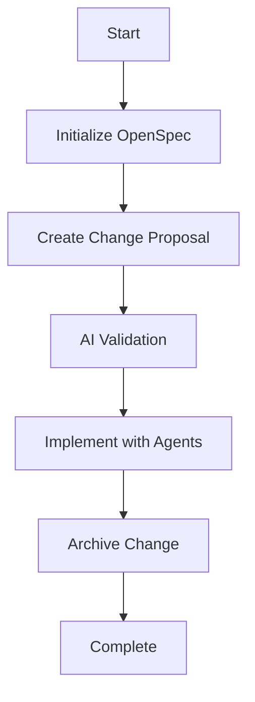

# OpenSpec User Guide

## Overview

OpenSpec brings **spec-driven development** to your unified-ai-mcp-tool workflow. Instead of writing code first and hoping for the best, OpenSpec ensures that:

1. **Intent is captured clearly** before any code is written
2. **Requirements are structured and traceable** throughout development
3. **Changes are tracked and auditable** with full specification history
4. **Multi-agent collaboration** is coordinated through shared specifications

This guide covers both **individual tools** and **integrated workflows** for maximum productivity.

## Quick Start

### 1. Initialize OpenSpec in Your Project

```bash
# Initialize OpenSpec (may require interactive input)
openspec-init
```

**What happens:** Creates the `openspec/` directory structure and configures AI tool integrations.

### 2. Create Your First Specification

```bash
# Create a change proposal
openspec-proposal "Add user authentication with JWT tokens"

# View active changes
openspec-list

# Review the proposal details
openspec-show <change-name>
```

### 3. Implement the Feature

```bash
# Apply the change (implement the feature)
openspec-apply <change-name>
```

### 4. Complete the Change

```bash
# Archive when implementation is complete
openspec-archive <change-name>
```

## Individual Tools Reference

### openspec-init

**Purpose:** Initialize OpenSpec in your project directory.

**Parameters:**
- `aiTools` (optional): Array of AI tools to configure during initialization

**Example:**
```javascript
{
  "name": "openspec-init",
  "arguments": {
    "aiTools": ["claude-code", "cursor", "qoder"]
  }
}
```

**Output:** Project initialized with OpenSpec directory structure.

---

### openspec-proposal

**Purpose:** Create a new change proposal with specifications.

**Parameters:**
- `description`: Brief description of the change or feature
- `changeType` (optional): Type of change (feature, bugfix, improvement, refactor)

**Example:**
```javascript
{
  "name": "openspec-proposal",
  "arguments": {
    "description": "Add OAuth2 authentication endpoint",
    "changeType": "feature"
  }
}
```

**Note:** This command may require interactive input for detailed specification creation.

---

### openspec-list

**Purpose:** List all active change proposals in the project.

**Parameters:** None

**Example:**
```javascript
{
  "name": "openspec-list",
  "arguments": {}
}
```

**Output:** List of active changes with their IDs and brief descriptions.

---

### openspec-show

**Purpose:** Show detailed information about a specific change proposal.

**Parameters:**
- `changeId`: Name/ID of the change to show details for

**Example:**
```javascript
{
  "name": "openspec-show",
  "arguments": {
    "changeId": "add-oauth-endpoint"
  }
}
```

**Output:** Complete proposal details including specifications, tasks, and requirements.

---

### openspec-apply

**Purpose:** Apply a change proposal and implement the specified feature.

**Parameters:**
- `changeId`: Name/ID of the change to apply

**Example:**
```javascript
{
  "name": "openspec-apply",
  "arguments": {
    "changeId": "add-oauth-endpoint"
  }
}
```

**Output:** Feature implementation completed according to specifications.

---

### openspec-archive

**Purpose:** Archive a completed change into the source specifications.

**Parameters:**
- `changeId`: Name/ID of the completed change
- `force` (optional): Force archive without confirmation prompts

**Example:**
```javascript
{
  "name": "openspec-archive",
  "arguments": {
    "changeId": "add-oauth-endpoint",
    "force": false
  }
}
```

**Output:** Change archived and specifications merged into project documentation.

## Integrated Workflow: openspec-driven-development

For the ultimate spec-driven development experience, use the integrated workflow that orchestrates all OpenSpec tools with your existing agents.

### Workflow Overview



### Using the Integrated Workflow

**Parameters:**
- `featureDescription`: Description of the feature to implement
- `projectInitialized`: Whether OpenSpec is already initialized
- `aiTools`: AI tools to configure
- `changeType`: Type of change (feature, bugfix, etc.)
- `targetFiles`: Files that will be affected
- `implementationApproach`: How to implement (incremental, full-rewrite, minimal)
- `autonomyLevel`: Agent autonomy level
- `validationBackends`: AI backends for specification validation

**Example Usage:**
```javascript
{
  "name": "smart-workflows",
  "arguments": {
    "workflow": "openspec-driven-development",
    "params": {
      "featureDescription": "Add user registration with email verification",
      "changeType": "feature",
      "targetFiles": ["src/auth/register.py", "src/auth/email.py"],
      "implementationApproach": "incremental",
      "autonomyLevel": "low",
      "validationBackends": ["ask-gemini", "cursor-agent"]
    }
  }
}
```

### What the Workflow Does

1. **Step 1: Initialization**
   - Initializes OpenSpec if not already done
   - Configures AI tool integrations

2. **Step 2: Specification Creation**
   - Creates change proposal with detailed specifications
   - Generates structured requirements in EARS format

3. **Step 3: AI Validation**
   - Multiple AI backends review and validate specifications
   - Ensures clarity and completeness before implementation

4. **Step 4: Implementation**
   - Uses existing `feature-design` workflow
   - Agents implement according to approved specifications
   - Maintains code quality and follows best practices

5. **Step 5: Completion**
   - Archives change into living documentation
   - Specifications become part of project knowledge base

## Directory Structure

After OpenSpec initialization, your project will have:

```
your-project/
├── openspec/
│   ├── specs/           # Source of truth specifications
│   │   ├── auth/
│   │   │   └── spec.md
│   │   └── api/
│   │       └── spec.md
│   └── changes/         # Active change proposals
│       ├── add-oauth/
│       │   ├── proposal.md
│       │   ├── tasks.md
│       │   └── specs/
│       │       └── auth/
│       │           └── spec.md
│       └── archived/    # Completed changes
```

## Language-Specific Considerations

### Python Projects

**Best Practices:**
- Specify FastAPI/Django/Flask frameworks explicitly
- Include async/await patterns when relevant
- Reference Pydantic models and type hints
- Mention `__init__.py` and package structure

**Example Specification:**
```markdown
### Requirement: Async Authentication Endpoint
The system SHALL provide an async authentication endpoint using FastAPI.

#### Scenario: Successful login
- GIVEN user provides valid credentials
- WHEN POST /auth/login with UserCredentials model
- THEN return JWT token with 200 status
- AND use Pydantic validation for input
```

### Go Projects

**Best Practices:**
- Specify interface usage and receivers
- Include error handling patterns (`if err != nil`)
- Reference package structure (cmd/, pkg/, internal/)
- Mention goroutines and channels when applicable

**Example Specification:**
```markdown
### Requirement: gRPC Health Service
The system SHALL implement gRPC health checking interface.

#### Scenario: Health check request
- GIVEN gRPC client calls Health.Check()
- WHEN service is operational
- THEN return SERVING status
- AND use proper error handling with grpc.Status
```

### Rust Projects

**Best Practices:**
- Mention ownership and borrowing when relevant
- Include Result<T, E> and Option<T> patterns
- Reference Cargo.toml for dependencies
- Specify memory safety considerations

**Example Specification:**
```markdown
### Requirement: Safe JSON Serialization
The system SHALL serialize user data with compile-time safety.

#### Scenario: User data export
- GIVEN valid User struct with owned data
- WHEN serialize to JSON format
- THEN use Serde derive macros
- AND return Result<String, Error> for error handling
```

## Troubleshooting

### Common Issues

**"Command requires interactive input"**
- **Cause:** OpenSpec commands sometimes need user interaction
- **Solution:** Run the command manually in terminal, then use MCP tools for subsequent steps

**"OpenSpec not initialized"**
- **Cause:** Project hasn't been set up with OpenSpec
- **Solution:** Run `openspec-init` first

**"Change not found"**
- **Cause:** Change ID doesn't exist or was already archived
- **Solution:** Use `openspec-list` to see active changes

### Getting Help

1. **Check active changes:** `openspec-list`
2. **Review change details:** `openspec-show <change-id>`
3. **Use integrated workflow:** `openspec-driven-development` for full automation
4. **Manual execution:** When automated tools require interaction

## Advanced Usage

### Custom Specification Templates

You can customize specification templates for your project's needs by modifying files in `openspec/templates/`.

### Integration with CI/CD

OpenSpec works well with CI/CD pipelines:
- Validate specifications before builds
- Archive changes automatically on deployment
- Track specification coverage in tests

### Multi-Agent Collaboration

Use OpenSpec to coordinate multiple AI agents:
- Each agent focuses on specific aspects of the specification
- Changes are tracked and merged systematically
- Audit trail maintained for all modifications

## Migration from Manual Development

### Before OpenSpec
1. Vague requirements in chat history
2. Code written without clear specifications
3. Difficult to track changes and intent
4. Quality issues from unclear requirements

### After OpenSpec
1. Structured specifications before coding
2. Clear requirements with EARS format
3. Auditable change history
4. Improved code quality and consistency

## Best Practices

### Specification Writing
- Use EARS format for all requirements
- Include acceptance criteria for each scenario
- Specify error conditions and edge cases
- Reference existing specifications for consistency

### Change Management
- Create focused changes rather than large refactorings
- Archive changes promptly after completion
- Use meaningful change names and descriptions
- Review specifications before implementation

### Tool Usage
- Start with `openspec-driven-development` workflow for new features
- Use individual tools when you need more control
- Always check `openspec-list` before creating new changes
- Archive completed work to maintain clean project state

---

**OpenSpec Version:** 0.15.0
**Integration Version:** Phase 2 Complete
**Last Updated:** November 19, 2025

**Need Help?** Check the integrated workflow examples or use individual tools with clear descriptions for best results.
