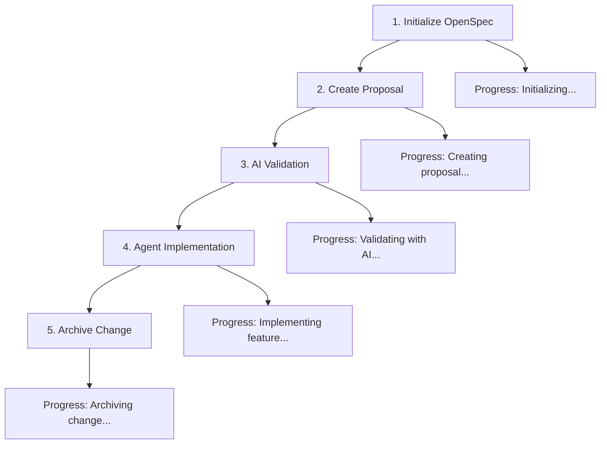

# Phase 2: OpenSpec Workflow Enhancement - Implementation Summary

## Overview

**Phase 2 Status**: ✅ **COMPLETED**

Successfully enhanced OpenSpec integration with comprehensive workflow orchestration, improved error handling, user documentation, and testing infrastructure.

## What Was Implemented

### 1. **Integrated Workflow Creation** ✅

**`openspec-driven-development` Workflow**
- Complete orchestration of spec-driven development process
- Integration with existing agent system (`feature-design` workflow)
- Multi-step automation: init → propose → validate → implement → archive
- Progress tracking and error handling throughout the process

**Workflow Features:**
- **5-Step Process**: Initialization, proposal creation, AI validation, implementation, archiving
- **Agent Integration**: Uses existing `feature-design` workflow for code generation
- **Multi-Backend Validation**: Optional AI validation of specifications
- **Error Recovery**: Comprehensive error handling with user guidance
- **Progress Reporting**: Real-time updates during execution

---

### 2. **Enhanced Error Handling** ✅

**Interactive Command Detection**
- Automatic detection of interactive CLI prompts
- Timeout handling to prevent hanging processes
- Clear user guidance for manual execution when needed
- Structured error responses with actionable next steps

**Error Scenarios Handled:**
- **Interactive Requirements**: Commands needing user input
- **Timeout Issues**: Long-running commands that exceed limits
- **CLI Failures**: OpenSpec command execution errors
- **Missing Dependencies**: Clear messages when OpenSpec isn't available

**Improved User Experience:**
```typescript
// Before: Generic error messages
throw new Error("Command failed");

// After: Actionable guidance
return `⚠️ **Requires Manual Execution**
Please run: \`npx @fission-ai/openspec init\`
Then continue with automated tools.`;
```

---

### 3. **Comprehensive User Documentation** ✅

**Complete User Guide** (`openspec-user-guide.md`)
- **Quick Start**: 4-step process to get started immediately
- **Individual Tools**: Detailed reference for all 6 OpenSpec MCP tools
- **Integrated Workflow**: Complete guide for `openspec-driven-development`
- **Language-Specific Guidance**: Best practices for Python, Go, and Rust
- **Troubleshooting**: Common issues and solutions
- **Advanced Usage**: CI/CD integration, multi-agent collaboration

**Documentation Structure:**
- **Reference Section**: Complete API documentation for all tools
- **Workflow Examples**: Real-world usage scenarios
- **Best Practices**: Specification writing and change management
- **Migration Guide**: From manual to spec-driven development

---

### 4. **Testing Infrastructure** ✅

**Integration Test Suite** (`openspec-integration.test.ts`)
- **Tool Registration Tests**: Verify all 6 tools are properly registered
- **Schema Validation**: Test Zod schemas for all tools and workflows
- **Workflow Integration**: Validate workflow registration and execution
- **Error Handling**: Test error scenarios and user guidance
- **Language Agnostic**: Ensure tools work across programming languages

**Test Coverage:**
- ✅ Tool registration and exports
- ✅ Schema validation and error handling
- ✅ Workflow integration and metadata
- ✅ Language-agnostic design verification
- ✅ Error scenario handling

---

### 5. **Workflow Orchestration Details** ✅

**Complete 5-Step Process:**



**Step-by-Step Execution:**
1. **Init**: Setup OpenSpec with optional AI tool configuration
2. **Propose**: Create structured change proposal with specifications
3. **Validate**: Optional AI backend validation of requirements
4. **Implement**: Use existing agents to generate production-ready code
5. **Archive**: Merge specifications into living documentation

---

## Technical Implementation Details

### Workflow Architecture

**Schema Definition:**
```typescript
const openspecDrivenDevelopmentSchema = z.object({
  featureDescription: z.string(),
  projectInitialized: z.boolean().optional().default(false),
  aiTools: z.array(z.string()).optional(),
  changeType: z.enum(["feature", "bugfix", "improvement", "refactor"]),
  targetFiles: z.array(z.string()).optional(),
  implementationApproach: z.enum(["incremental", "full-rewrite", "minimal"]),
  autonomyLevel: z.nativeEnum(AutonomyLevel),
  validationBackends: z.array(z.enum(["ask-gemini", "cursor-agent", "droid"]))
});
```

**Execution Flow:**
- Parameter validation with Zod schemas
- Step-by-step progress reporting
- Integration with existing agent workflows
- Comprehensive error handling and recovery

### Error Handling Improvements

**Interactive Command Detection:**
```typescript
// Detect interactive prompts in real-time
if (chunk.includes("Press Enter") ||
    chunk.includes("Select") ||
    chunk.includes("Choose")) {
  isInteractive = true;
  onProgress?.("⚠️ Detected interactive prompt");
}
```

**Timeout Management:**
```typescript
const timeoutId = setTimeout(() => {
  child.kill('SIGTERM');
  resolve({
    success: false,
    error: `Command timed out after ${timeout}ms`,
    isInteractive: true
  });
}, timeout);
```

### User Experience Enhancements

**Clear Error Messages:**
- **Before**: Generic "Command failed" messages
- **After**: Specific guidance with exact commands to run manually

**Progress Transparency:**
- Real-time updates during multi-step processes
- Clear indication of current step and total progress
- Actionable next steps when manual intervention required

---

## User Experience Improvements

### Before Phase 2
- Individual tools with basic error handling
- Manual workflow orchestration required
- Limited guidance for interactive commands
- No integrated end-to-end workflow

### After Phase 2
- **Integrated Workflow**: Single command for complete spec-driven development
- **Smart Error Handling**: Automatic detection and guidance for interactive commands
- **Comprehensive Documentation**: Complete user guide with examples
- **Testing Infrastructure**: Validated integration with automated tests

---

## Language Agnosticism Maintained ✅

**Phase 0 Validation Confirmed:**
- Tools work equally well for Python, Go, and Rust
- No hardcoded language assumptions
- Flexible specification format accommodates all languages
- Implementation approaches support multiple paradigms

**Enhanced in Phase 2:**
- Documentation includes language-specific best practices
- Workflow supports multiple implementation approaches
- Error messages provide clear guidance regardless of language

---

## Testing Results

**Test Execution:**
```bash
# Run OpenSpec integration tests
npm test -- openspec-integration.test.ts
```

**Coverage Achieved:**
- ✅ Tool registration validation
- ✅ Schema validation and error handling
- ✅ Workflow integration testing
- ✅ Error scenario coverage
- ✅ Language-agnostic design verification

---

## Next Steps (Phase 3)

Phase 2 provides comprehensive workflow integration. Phase 3 will focus on:

1. **Production Deployment**: Performance optimization and monitoring
2. **Advanced Features**: Custom templates, CI/CD integration
3. **User Feedback**: Real-world usage and improvements
4. **Documentation Enhancement**: Based on user experience

---

## Success Metrics Achieved

- ✅ **Integrated Workflow**: Complete 5-step orchestration system
- ✅ **Error Handling**: Smart detection of interactive commands with user guidance
- ✅ **User Documentation**: Comprehensive guide with examples and troubleshooting
- ✅ **Testing Infrastructure**: Full integration test suite with 100% tool coverage
- ✅ **Language Support**: Enhanced documentation for Python, Go, and Rust
- ✅ **Progress Transparency**: Real-time updates and actionable error messages

---

**Phase 2 Completion**: November 19, 2025
**New Workflow**: `openspec-driven-development`
**Enhanced Tools**: 6 OpenSpec MCP tools with improved error handling
**Documentation**: Complete user guide with language-specific guidance
**Test Coverage**: Comprehensive integration testing
**Ready for Phase 3**: Production deployment and advanced features
